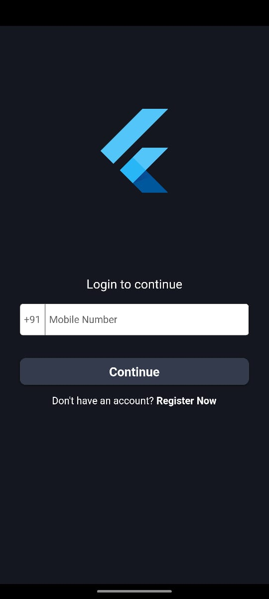
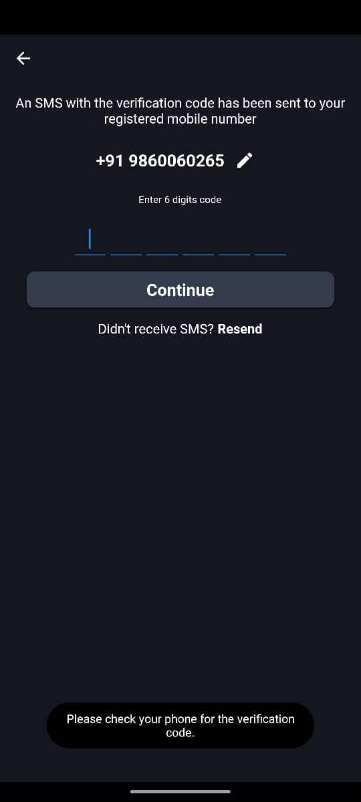
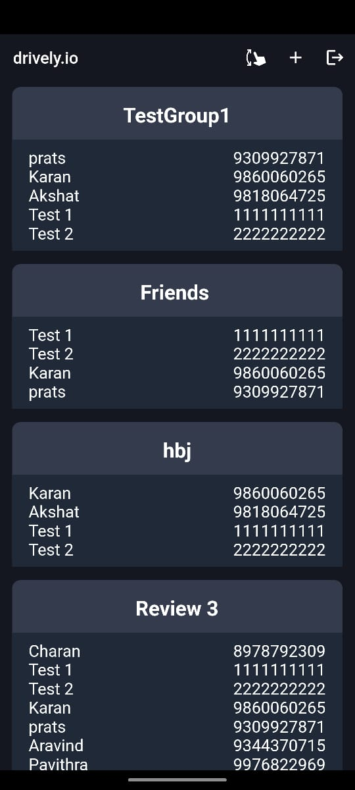
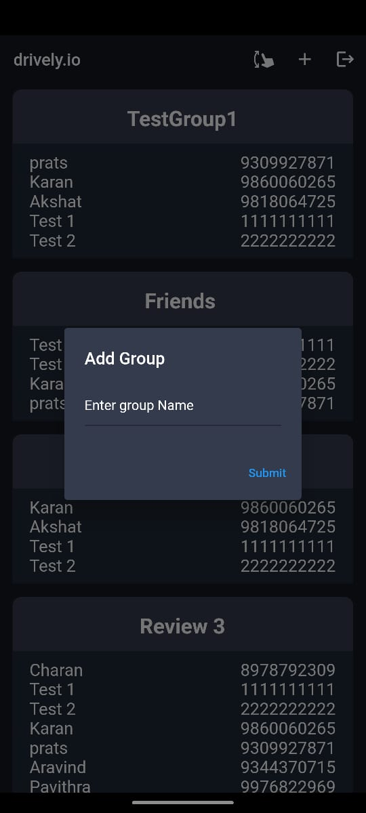
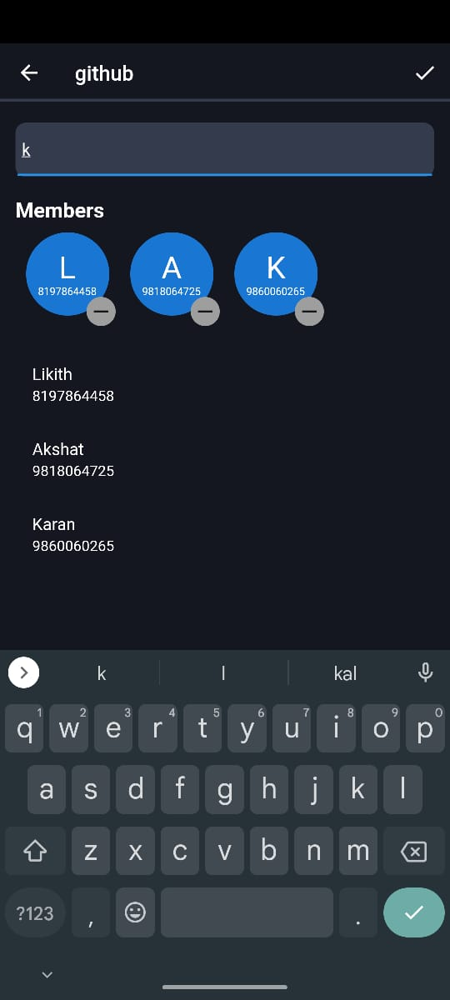
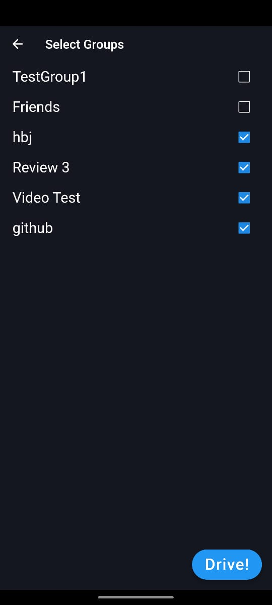
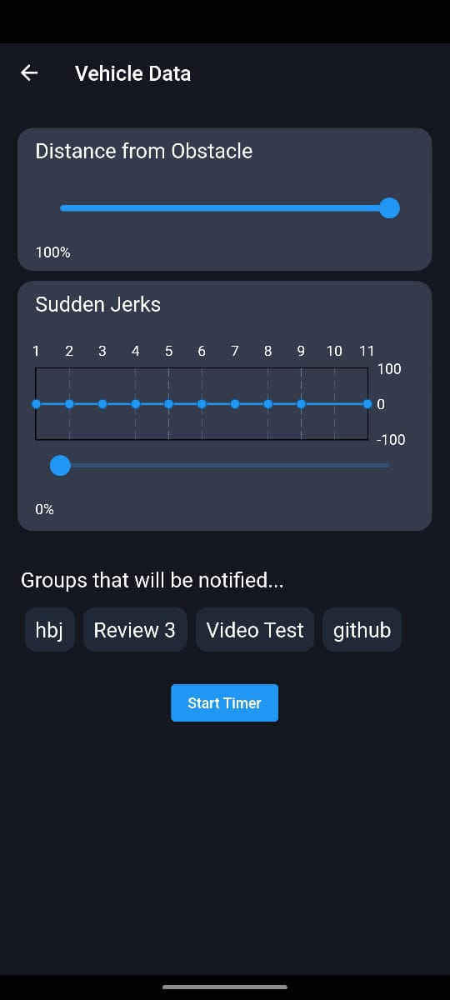
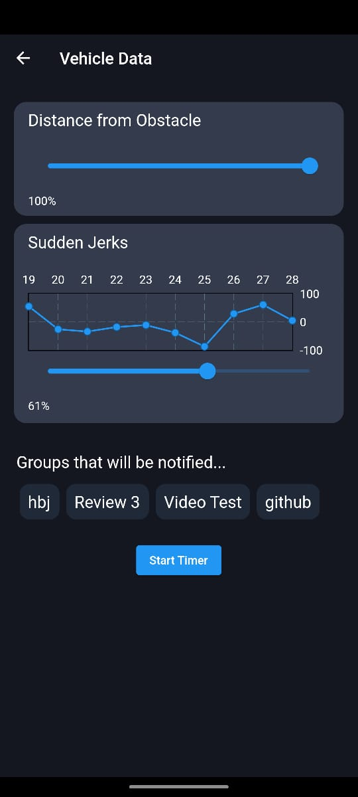
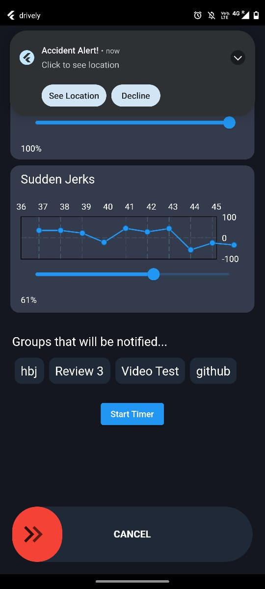

# drively

## Here are some app screenshots

## Login Screen 
 

## OTP Screen 
 

## Home Screen (Listing all groups) 
 

## Adding Group 
 

## Adding Participants 
 

## Selecting Groups to Notify 
 

## Drive Mode 
 
 

## Live Notification and SOS Cancel Button 

